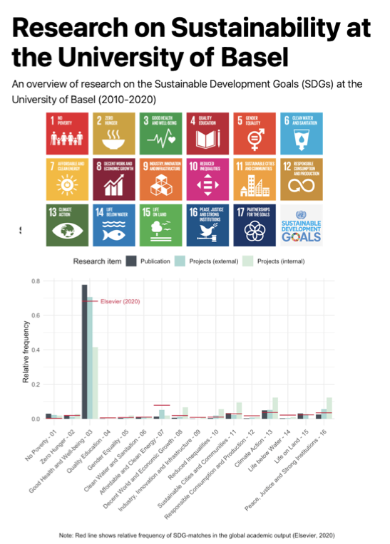
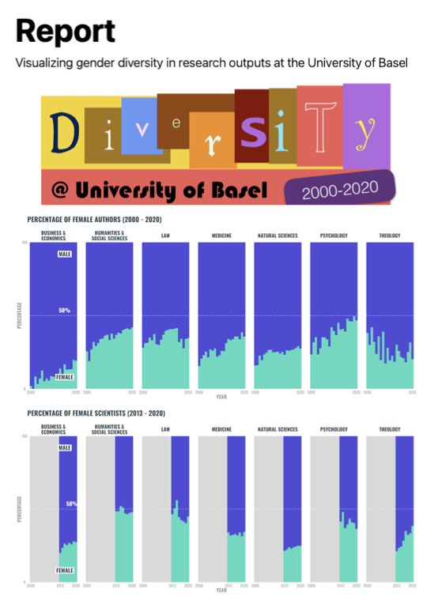

```{r setup, include=FALSE}
knitr::opts_chunk$set(echo = FALSE)
``` 

## Report

We will report the results of our hackathon on this page. Click the images below for examples of reports resulting from past CDS hackathons:

<a href="https://cdsbasel.github.io/SDG_hackathon/report.html">
  
</a>

<a href="https://cdsbasel.github.io/Diversity_hackathon/report.html">
  
</a>
