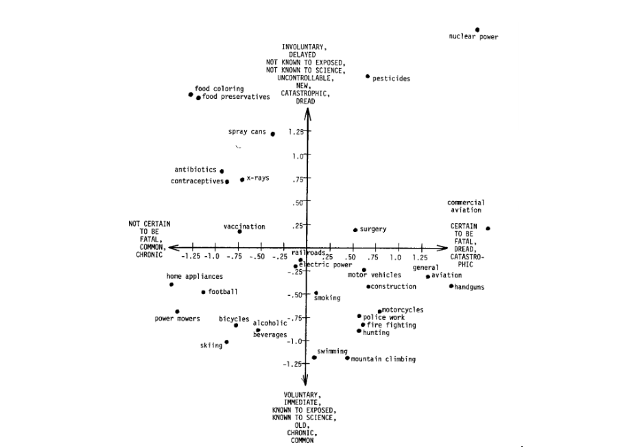

```{r setup, include=FALSE}
knitr::opts_chunk$set(echo = FALSE)
``` 

# Background

The past years have shown that risk perception and risk communication are key issues in today's societies dealing with important problems, from pandemics to climate change. A number of voices have argued for the need to understand and estimate the public's risk perceptions in many domains to better target specific interventions and help both laypeople, experts, and policy-makers make better, informed decisions (e.g., Jenny & Betsch, 2022). 

The Risk Hackathon aimed to provide a training opportunity in data analytics while showcasing relevant work on risk perception by the Center for Cognitive and Decision Sciences. The hackathon proposed a set challenges linked to analysing a new data set on risk perception and evaluating the performance of novel models to predict risk perception in this novel data set. 

The hackathon used data from a pre-registered [study](https://osf.io/6m7xr) by Hussain et al. conducted in 2022 designed to compare the performance of the classic psychometric paradigm (Fischhoff et al., 1978) against novel models that rely on language embeddings (e.g., Bahtia, 2016). In this context, embeddings refer to vector representations of words obtained from natural language processing models trained on large amounts of text data or other data sources (e.g., free associations). 

The Hussain et al. study involved asking thousands of participants to rate over 1000 words or terms (e.g., handgun, vaccination, artificial intelligence) concerning their perceived risk, with each word being rated on a scale of -100 (safe) to +100 (risky). The same words were also rated on 9 (psychometric) dimensions concerning, for example, whether the risk is typically fatal, controllable, voluntary, etc. The ratings from several respondents were averaged to create an average risk and psychometric ratings that were then utilized in the hackathon and to compare the predictions of different models concerning average risk perception for each word. 

# Hackathon

A hackathon is a group event that gets individuals to work on a common problem using code. In the CDS Risk Hackathon participants were asked to answer a number of questions pertaining to how people perceive risks to be answered using data visualization in R. The specific questions and data descriptors are provided [here](hackathon.html). The participants were organized intro groups of 4 to 5 people and collaborated to produce answers to the challenges in the form of data visualizations. CDS members provided training prior to the hackathon in the form of an R refresher course in the morning of the event. After the hackthon event, participants discussed their experience over drinks and pizza.

# Results

The results presented below are a subset of the data visualizations produced by the hackathon participants and are used to give an idea of the sort of products generated by the hackathon. The full analysis of the data used will be provided in a scientific manuscript (Hussain et al., in preparation). 

```{r}
library(tidyverse)
require(ggrepel)
library(ggside)
library(fmsb)
library(patchwork)

risk = read_csv("risk_hackathon.csv")
cols = viridis::cividis(5,end=.9)

```

#### Items related to crime, war, and violence, are seen as most risky  

Many of the word (i.e., events or actions) rated as most risky have to do with crime, war, or violence. A number of health-related items and technologies are also seen as quite risky on average. Some hackathon participants used density plots to obtain an overview of risk ratings that make clear the average differences between these different types of risks. 

```{r, fig.asp = .6}
groups = c("Crime / War / Violence",
           "Health",
           "Transportation",
           "Nature / Food",
           "Activities / Technologies")
p = risk %>%
  mutate(cluster_fct = factor(cluster, levels = groups)) %>%
  ggplot(mapping = aes(x = risk_ratings,
                       fill = cluster_fct,
                       col = cluster_fct)) +
    geom_density() +
    xlim(c(-100, 100)) +
    theme_minimal() +
  scale_fill_viridis_d(option = "E", alpha = .5, end = .95) +
  scale_color_viridis_d(option = "E", alpha = .7, end = .95) +
  theme(axis.text.y = element_blank(),
        axis.title.y = element_blank(),
        legend.position = "none") +
  labs(x = "Risk rating")
pos = ggplot_build(p)$data[[1]] %>%
  group_by(group) %>%
  summarize(x = x[which.max(y)],
            y = max(y)) %>%
  mutate(label = groups,
         cluster_fct = factor(label, levels = label))

p + geom_label_repel(data = pos,
                     mapping = aes(x = x, y = y, label = groups),
                     fill = "white",nudge_y = .001, force = .01)
```


#### Items differ considerably in their psychometric profile  

The different types of risks have different profiles concerning different psychometric dimensions. Some hackathon participants used radar charts to explore the profiles of different types of risks, including older ones, like handgungs and newer ones, like artificial intelligence. 


```{r, fig.asp = .6}
dat <- risk %>% 
  rename(involuntary = psych_voluntary,
         fatal = psych_fatal,
         delayed = psych_immediate,
         dread = psych_dread,
         catastrophic = psych_catastrophic,
         controllable = psych_controllable,
         unknown_sci = psych_known_sci,
         unknown = psych_known,
         old = psych_new)

df_radarchart <- dat %>% filter(word %in% c("handgun", "vaccination", "artificial intelligence")) %>% select(word, involuntary:old) %>%
  add_row(.before = TRUE, word = "Min", involuntary = 1, fatal = 1, delayed = 1, dread = 1, catastrophic = 1, controllable = 1, unknown_sci = 1, unknown = 1, old = 1) %>%
  add_row(.before = TRUE, word = "Max", involuntary = 7, fatal = 7, delayed = 7, dread = 7, catastrophic = 7, controllable = 7, unknown_sci = 7, unknown = 7, old = 7) %>% 
  column_to_rownames(var = "word")

create_radarchart <- function(data, color = "#00AFBB", 
                              vlabels = colnames(data), vlcex = 0.7,
                              caxislabels = NULL, title = NULL, ...)
{
  radarchart(
    data,
    # Customize the polygon
    pcol = color, pfcol = scales::alpha(color, 0.5), plwd = 2, plty = 1,
    # Customize the grid
    cglcol = "grey", cglty = 3, cglwd = 0.8,
    # Customize the axis
    axislabcol = "grey", 
    # Variable labels
    vlcex = vlcex, vlabels = vlabels, 
    caxislabels = caxislabels, title = NA, ...
  )
  mtext(title, line=-3, font=1)
}

colors <- cols[c(5,2,1)]
titles <- rownames(df_radarchart)[3:nrow(df_radarchart)]

par(mfrow=c(1,3), mar=c(0,0,1,0))

# Plot 3 (handgun):
create_radarchart(
  data = df_radarchart[c(1, 2, 5), ], seg = 6,
  color = colors[3], title = titles[3]
)

# Plot 2 (vaccination):
create_radarchart(
  data = df_radarchart[c(1, 2, 4), ],seg = 6,
  color = colors[2], title = titles[2]
)

# Plot 1 (artificial intelligence):
create_radarchart(
  data = df_radarchart[c(1, 2, 3), ], seg = 6,
  color = colors[1], title = titles[1]
)

```

#### Replicating the two-dimensional representation of risk perception  

Participants were asked to replicate the classic two-dimensional visual representation of risks by Fischhoff et al. (1978)

<a href="https://link.springer.com/article/10.1007/BF00143739">
  
</a>

Some participants created a modern version of the plot - including 1004 risks and highlighting those that were also present in Fischhoff et al. (1978). 

```{r}
data <- risk
data$category <- factor(data$cluster, levels=c("Activities / Technologies", "Crime / War / Violence", "Health", "Nature / Food", "Transportation" ))

plot_main <- data %>% 
  bind_cols(tibble(risk = scales::rescale(data$risk_ratings))) %>% 
  ggplot(aes(y = psych_pc1, x = psych_pc2)) +
  geom_hline(yintercept = 0) +
  geom_vline(xintercept = 0) +
  geom_point(aes(color = risk), alpha = 0.8, size = 5) +
  scale_colour_viridis_c() +
  geom_label(data = data %>% filter(in_Fisch == TRUE), aes(label = word)) +
  theme_minimal() +
  coord_cartesian(xlim = c(-5, 5), ylim = c(-9.5, 9.5)) +
  annotate("label", x = 5, y = 1, label = "known", fill = "grey20", color = "white") +
  annotate("label", x = 5, y = 0, label = "voluntary", fill = "grey20", color = "white") +
  annotate("label", x = 5, y = -1, label = "immediate", fill = "grey20", color = "white") +
  annotate("label", x = -5, y = 1, label = "unknown", fill = "grey20", color = "white") +
  annotate("label", x = -5, y = 0, label = "involuntary", fill = "grey20", color = "white") +
  annotate("label", x = -5, y = -1, label = "delayed", fill = "grey20", color = "white") +
  annotate("label", x = 0, y = 9.5, label = "dread", fill = "grey20", color = "white") +
  annotate("label", x = 0, y = 9, label = "fatal", fill = "grey20", color = "white") +
  annotate("label", x = 0, y = 8.5, label = "uncontrollable", fill = "grey20", color = "white") +
  annotate("label", x = 0, y = 8, label = "involuntary", fill = "grey20", color = "white") +
  annotate("label", x = 0, y = -8, label = "calm", fill = "grey20", color = "white") +
  annotate("label", x = 0, y = -8.5, label = "non-fatal", fill = "grey20", color = "white") +
  annotate("label", x = 0, y = -9, label = "controllable", fill = "grey20", color = "white") +
  annotate("label", x = 0, y = -9.5, label = "voluntary", fill = "grey20", color = "white")  +
  theme(legend.position="none") +
    theme(axis.text = element_blank(),  
        axis.ticks = element_blank(),
        axis.title =element_blank())
  
data$alpha <- (data$risk_ratings + 100) / 200

# for individual categories
data.activ <- data %>% filter(category=="Activities / Technologies")
activities <- data.activ %>% 
  ggplot(aes(y = psych_pc1, x = psych_pc2, color=alpha)) +
  geom_hline(yintercept = 0) +
  geom_vline(xintercept = 0) +
  geom_point( size = 3, alpha=.8) +
  scale_colour_viridis_c() +
  theme_minimal() + labs(x=NULL, y=NULL) +
  coord_cartesian(xlim = c(-5, 5), ylim = c(-8, 8)) +
  labs(subtitle="Activities / Technologies", alpha=NULL) + theme(legend.position = "none") +
    theme(axis.text = element_blank(),  
        axis.ticks = element_blank(),
        axis.title =element_blank())

data.crime <- data %>% filter(category=="Crime / War / Violence")
crime <- data.crime %>% 
  ggplot(aes(y = psych_pc1, x = psych_pc2, color=alpha)) +
  geom_hline(yintercept = 0) +
  geom_vline(xintercept = 0) +
  geom_point( size = 3, alpha=.8) +
  scale_colour_viridis_c() +
  theme_minimal() + labs(x=NULL, y=NULL) +
  coord_cartesian(xlim = c(-5, 5), ylim = c(-8, 8)) +
  labs(subtitle="Crime / War / Violence", alpha=NULL) + theme(legend.position = "none") +
    theme(axis.text = element_blank(),  
        axis.ticks = element_blank(),
        axis.title =element_blank())

data.health <- data %>% filter(category=="Health")
health <- data.health %>% 
  ggplot(aes(y = psych_pc1, x = psych_pc2, color=alpha)) +
  geom_hline(yintercept = 0) +
  geom_vline(xintercept = 0) +
  geom_point( size = 3, alpha=.8) +
  scale_colour_viridis_c() +
  theme_minimal() + labs(x=NULL, y=NULL) +
  coord_cartesian(xlim = c(-5, 5), ylim = c(-8, 8)) +
  labs(subtitle="Health", alpha=NULL) + theme(legend.position = "none") +
    theme(axis.text = element_blank(),  
        axis.ticks = element_blank(),
        axis.title =element_blank())

data.nature <- data %>% filter(category=="Nature / Food")
nature <- data.nature %>% 
  ggplot(aes(y = psych_pc1, x = psych_pc2, color=alpha)) +
  geom_hline(yintercept = 0) +
  geom_vline(xintercept = 0) +
  geom_point( size = 3, alpha=.8) +
  scale_colour_viridis_c() +
  theme_minimal() + labs(x=NULL, y=NULL) +
  coord_cartesian(xlim = c(-5, 5), ylim = c(-8, 8)) +
  labs(subtitle="Nature / Food", alpha=NULL) + theme(legend.position = "none") +
    theme(axis.text = element_blank(),  
        axis.ticks = element_blank(),
        axis.title =element_blank())

data.transport <- data %>% filter(category=="Transportation")
transport <- data.transport %>% 
  ggplot(aes(y = psych_pc1, x = psych_pc2, color=alpha)) +
  geom_hline(yintercept = 0) +
  geom_vline(xintercept = 0) +
  geom_point( size = 3, alpha=.8) +
  scale_colour_viridis_c() +
  theme_minimal() + labs(x=NULL, y=NULL) +
  coord_cartesian(xlim = c(-5, 5), ylim = c(-8, 8)) +
  labs(subtitle="Transportation", alpha=NULL) + theme(legend.position = "none") + 
  theme(axis.text = element_blank(),  
        axis.ticks = element_blank(),
        axis.title =element_blank())


layout <- "
AAAAAB
AAAAAC
AAAAAD
AAAAAE
AAAAAF
"
#plot_main + crime + health + transport + nature + activities + plot_layout(design = layout)

plot_main 

ggsave("task2.png", width = 24, height = 16, units = "cm", scale = 1.5)
```


#### The results question the two-dimensional representation of risk perception...  

The second task asked participants to draw comparisons between past results (e.g., Fischhoff et al., 1978) and the novel results by Hussain et al. (2022). 

Many of the groups plotted a 2D representation. In addition, they also compared the PCA results. 

Finally, the groups were asked to compare the results of different models. 


```{r}
dat = risk %>%
  arrange(risk_ratings, in_Fisch) %>%
  mutate(cluster_fct = factor(cluster, levels = groups))

dat %>%
  select(starts_with("psych"),-psych_pred_risk,risk_ratings) %>%
  cor() %>%
  as.data.frame() %>%
  mutate(var = rownames(.)) %>%
  pivot_longer(-var) %>%
  filter(!str_detect(var, "[:digit:]"),
         str_detect(name, "[:digit:]")) %>%
  mutate(var = str_remove(var, "psych_"),
         name = str_remove(name, "psych_"),
         var = as_factor(var),
         name = factor(name,
                       levels = sort(unique(name), decreasing = T))) %>%
  ggplot(aes(x = var, y = name,
             label = round(value,2), fill = value)) +
   geom_tile() +
   geom_text(col = "white") +
   theme_minimal() +
   scale_fill_viridis_c() +
   theme(axis.text.x = element_text(angle = 45, hjust=1),
         axis.title = element_blank()) +
  theme(legend.position = "none") +
  geom_vline(xintercept = 9.5, col = "white", size=1)
```


# Limitations

The CDS Risk Hackathon has mostly a pedagogical character and, consequently, focused less on advancing our understanding of risk perception than providing participants with an opportunity to explore a novel data set. Nevertheless, some of the limitations of the data and analysis conducted should be emphasized.

- While great care was taken to ensure high reliability of the mean risk ratings and psychometric dimensions, the data used are averages of small numbers of English-speaking participants and, therefore, do not represent all possible assessments of risk perception. Past work suggested that are important individual and group preferences in risk assessments and it could be important to assess these to understand phenomena like risk polarization (cf. Wulff & Mata, 2022)
- Despite the data set of words representing the largest set of risks collected, there are likely others that haven't been considered, including some that may be very relevant (e.g., cyberfraud, microplastic, fusion)
- the models considered in the prediction exercise are only a subset of possible models and more sophisticated ones may be, including that the risks considered desprediction models used are based on single words not sentences

- the new models cannot beat the psychometric paradigm

- whether ensemble model can be used to predict risk perception in other contexts or more generally remains to be tested


# Conclusion


# Testimonials

"I really liked the close group collaboration and the fact that we had experienced team members who could help us." 

"I learned a lot as a R Novice thanks to the instructors' guidance"

It's a cool idea to split in different groups with one dataset and the same task. As in the end, we have different outcomes of visualizations and insights.

"the pizza was great :))"

# References

Bhatia, S. (2019). Predicting risk perception: New insights from data science. Management Science, 65(8), 3800–3823. https://doi.org/10.1287/mnsc.2018.3121

Fischhoff, B., Slovic, P., Lichtenstein, S., Read, S., & Combs, B. (1978). How safe is safe enough? A psychometric study of attitudes towards technological risks and benefits. Policy Sciences, 9(2), 127–152. https://doi.org/10.1007/BF00143739 

Jenny, M. A., & Betsch, C. (2022). Large-scale behavioural data are key to climate policy. Nature Human Behaviour, 6(11), 1444–1447. https://doi.org/10.1038/s41562-022-01479-4

Wulff, D. & Mata, R. (2022). On the semantic representation of risk. Science Advances, 8. https://science.org/doi/10.1126/sciadv.abm1883


